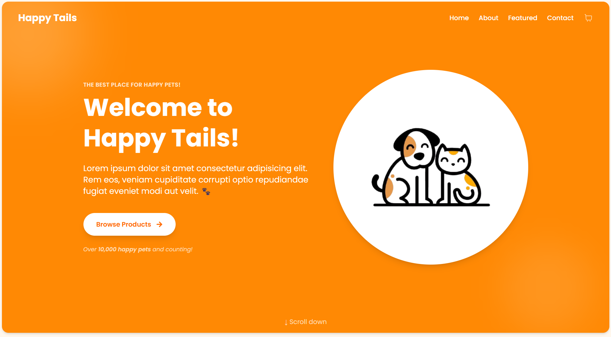
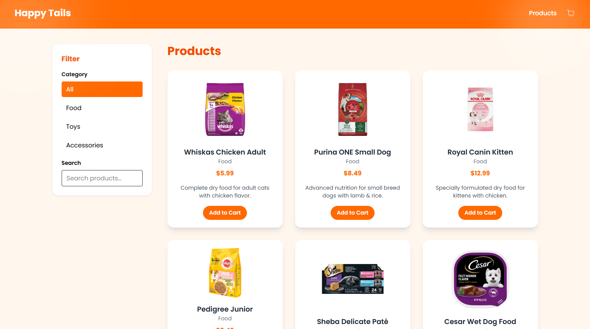
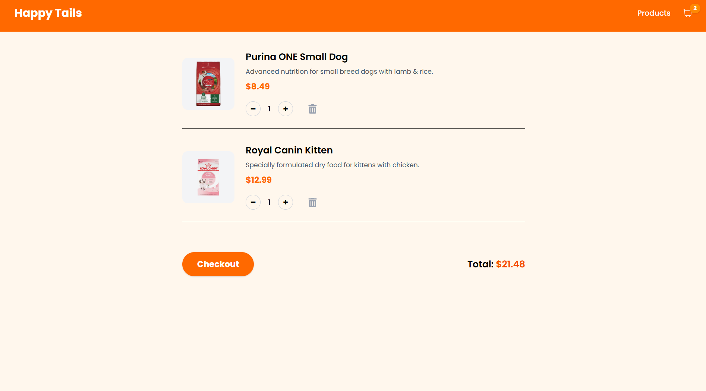
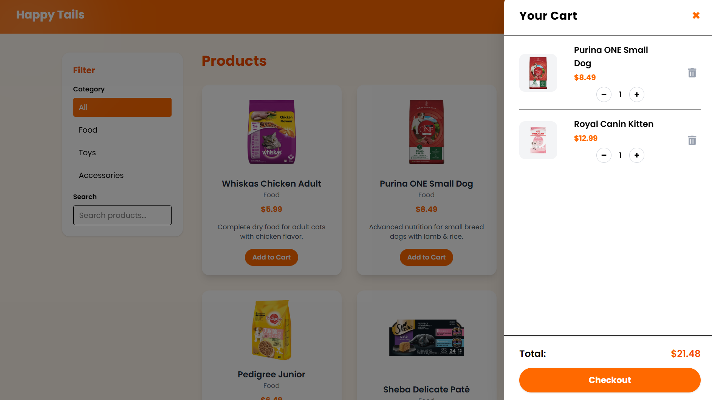

# 🚀 Happy Tails Petshop

A modern, responsive online pet store frontend built with React and Zustand. Happy Tails Petshop helps users browse products, manage their cart, and simulate checkout with a clean and engaging interface.

---

📸 Preview

  
  
  


---

## 🧰 Tech Stack

- Frontend: React, Vite, Tailwind CSS, React Router DOM, Zustand, Framer Motion
- Other Libraries: React Icons, Fuzzysort, Use-Debounce
- Dev Tools: ESLint, Git, GitHub
- Backend: Firebase Firestore (for cart persistence), Firebase Auth (for user authentication)

---

## ✨ Features

- Browse a curated selection of featured products including food, toys, and accessories for cats and dogs.
- Manage your shopping cart with ease.
- Cart data is persisted in Firebase Firestore per authenticated user.
- Demo checkout feature simulating payment processing (no real payment integration).
- Responsive and modern UI built with Tailwind CSS.
- Smooth animations using Framer Motion.
- Product search with fuzzy matching for quick results.

---

## 🏗️ Folder Structure

```
src/
├── components/       # Reusable UI components
├── pages/            # App pages (Landing, Cart, Products, Checkout)
├── sections/         # Page sections (Hero, About, FeaturedProducts, Contact, Footer)
├── store/            # Global state (Zustand), including cartStore with Firebase integration
├── data/             # Static product data
├── assets/           # Images and static assets
└── App.jsx           # Main application logic and routing
```

---

## ⚙️ Getting Started

### ✅ Prerequisites

- Node.js v14+
- npm v6+
- Firebase project with Firestore and Authentication enabled

### 🛠 Installation

```bash
# Clone the repo
git clone <https://github.com/IulianFrunza98/happy-tails-petshop>
cd happy-tails-petshop

# Install dependencies
npm install
```

### 🔧 Firebase Setup

1. Create a Firebase project at https://console.firebase.google.com/
2. Enable Firestore database.
3. Enable Firebase Authentication (e.g., Google sign-in).
4. Update `.env` file with your Firebase config variables (see `.env.example`).
5. Set Firestore security rules to allow authenticated users to read/write their own cart documents:

```rules
rules_version = '2';
service cloud.firestore {
  match /databases/{database}/documents {
    match /carts/{userId} {
      allow read, write: if request.auth != null && request.auth.uid == userId;
    }
  }
}
```

### 🚀 Run the App

```bash
npm run dev
```

Open your browser and navigate to `http://localhost:5173` (or the port shown in your terminal).

---

## 🧪 Build for Production

```bash
npm run build
```

---

## 🧰 Available Scripts

- `npm run dev` - Starts the development server.
- `npm run build` - Builds the app for production.
- `npm run preview` - Previews the production build locally.
- `npm run lint` - Runs ESLint to check for code issues.

---

## 🤝 Contributing

Feel free to fork the repository and submit a pull request. Feedback and improvements are welcome!

---

## 👤 Author

Your Name  
GitHub: [github-profile](https://github.com/IulianFrunza98)  
LinkedIn: [linkedin-profile](https://www.linkedin.com/in/iulian-frunz%C4%83-3689a8329/)  
Email: fiulian87@yahoo.com

---

## 📄 License

Licensed under the MIT License.

---
